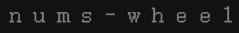

<p align="center">

</p>
<p align="center"><a href="https://www.npmjs.com/package/@simon_he/nums-wheel"></a></p>
<p align="center"><a href="https://www.hejian.club/posts/nums-wheel-zh">Docs</a></p>
<p align="center"> <a href="./README_en.md">English</a> | 简体中文</p>

## 此文是[simon-js-tool](https://www.npmjs.com/package/simon-js-tool)额外的numsWheel文档

## 更多
- 导出函数 [exports-function](https://github.com/SimonHe1995/exportsFunction)
- threejs [@simon_he/s-three](https://github.com/SimonHe1995/sThree)
- Echarts [@simon_he/s-chart](https://github.com/SimonHe1995/sCharts)
- Exports function [exports-function](https://github.com/SimonHe1995/exportsFunction)

## numsWheel
- 数字滚轮控件
- 无需在onMounted中调用,可以在任意地方调用
- 基于odometer封装, 更简单的在业务中使用
- 参数:
  - container: string | HTMLElement 父容器
  - options: {  format: '(,ddd)' | '(,ddd).dd' | '(.ddd),dd' | '( ddd),dd' | 'd' 数字格式 startVal: number 起始数字 endVal: number 最终数字  duration: number 动画时长  animation: 'count' | 'countdown' 动画方式 }
```javascript
numWheel('#main', {  endVal: 9000.12 }) // 默认format: '(,ddd).dd' startVal: 0 duration: 500 animation: 'countdown', 可以自定义format, startVal, duration, animation
```
