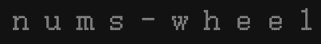

<p align="center">

</p>
<p align="center"><a href="https://www.npmjs.com/package/@simon_he/nums-wheel"></a></p>
<p align="center"><a href="https://www.hejian.club/posts/nums-wheel-zh">Docs</a></p>
<p align="center"> <a href="./README_en.md">English</a> | 简体中文</p>

## This article is an additional numsWheel documentation for [simon-js-tool] (https://www.npmjs.com/package/simon-js-tool).

## More
- Export function [exports-function](https://github.com/SimonHe1995/exportsFunction)
- threejs [@simon_he/s-three](https://github.com/SimonHe1995/sThree)
- Echarts [@simon_he/s-chart](https://github.com/SimonHe1995/sCharts)
- Exports function [exports-function](https://github.com/SimonHe1995/exportsFunction)

## numWheel
- Digital wheel control
- Based on the odometer package, it is simpler to use in the business
- params:
  - container: string | HTMLElement /* Parent container */
  - options: {  format: '(,ddd)' | '(,ddd).dd' | '(.ddd),dd' | '( ddd),dd' | 'd' /* Number format */ startVal: number /* The starting number */ endVal: number /* Final number */  duration: number /* The duration of the animation */  animation: 'count' | 'countdown' /* Animation mode */ }
```javascript
numWheel('#main', {  endVal: 9000.12 }) // Default format: '(,ddd).dd' startVal: 0 duration: 500 animation: 'countdown', Can be customized format, startVal, duration, animation
```
